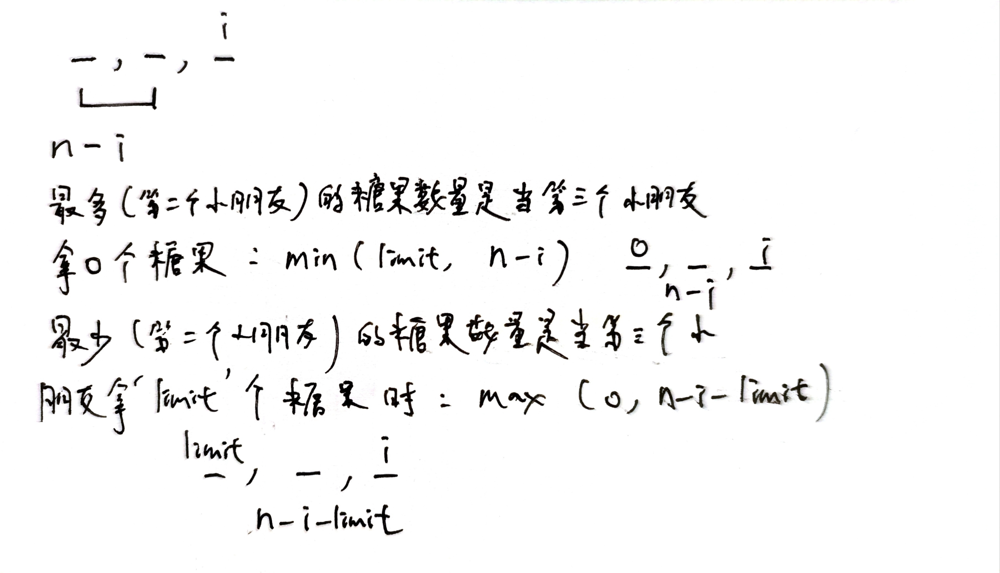

# 2928. 给小朋友们分糖果 I
[题目链接](https://leetcode.cn/problems/distribute-candies-among-children-i/description/)

## 方法一，枚举优化
该方法是对于枚举算法的优化，基于[leetcode官方题解](https://leetcode.cn/problems/distribute-candies-among-children-i/solutions/2791755/gei-xiao-peng-you-men-fen-tang-guo-i-by-9cgew/)。先枚举第一个小朋友可以拿到的糖果数，如何计算剩下两个两朋友可以拿到的糖果的数量，如果他们两可以拿到的总数`> limit * 2`，那么就无法为他俩分配。如果他们两可以拿到的总数`<= limit * 2`，那么可以通过第二个孩子可以拿到的糖果的方案数计算出总方案数。那么第二个小孩最多可以拿到的糖果的数量是`min(limit, n - i)`，其中`i`是指第一个孩子可以拿到的糖果数量。第二个小孩最少可以拿到的糖果的数量是`max(0, n - i - limit)`，其中`i`是指第一个孩子可以拿到的糖果数量。


### 代码
````c++
class Solution {
public:
    int distributeCandies(int n, int limit) {
        int res = 0;
        for (int i = 0; i <= min(limit, n); i++) {
            if (n - i > limit * 2) {
                continue;
            }
            res += min(limit, n - i) - max(0, n - i - limit) + 1;
        }
        return res;
    }
};
````

### 复杂度分析
+ 时间复杂度 $O(min(limit, n))$
+ 空间复杂度：$O(1)$
